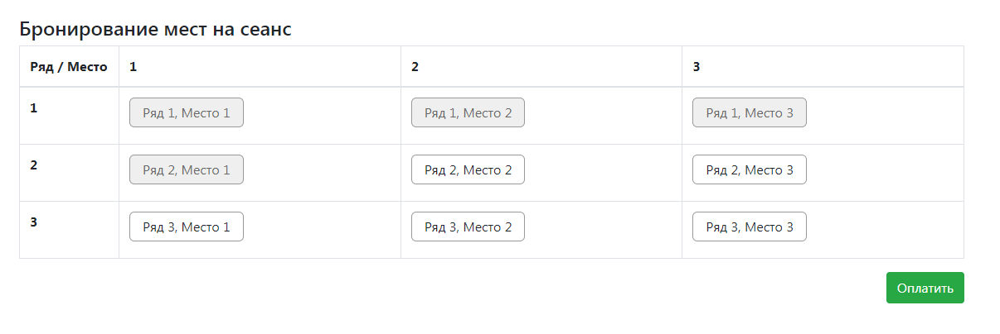
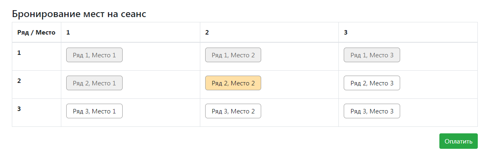
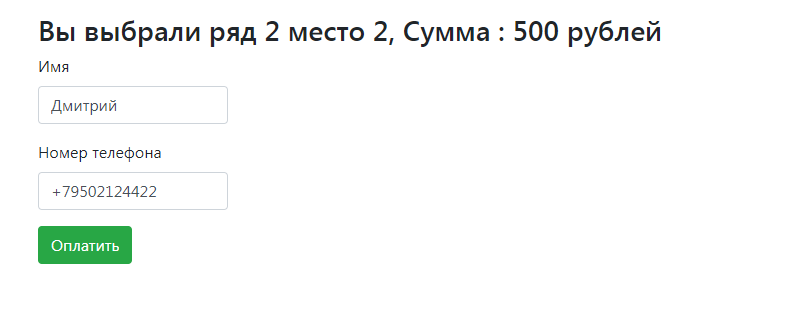

Проект "Сервис - Кинотеатр"
===========================

**О проекте:**
==

Проект для изучения Java EE.
Данное приложение представляет собой простую реализацию сайта для покупки билетов в кинотеатр. 
Пользователи могут выбрать места в зале кинотеатра и оплатить их. 
Также есть возможность обновлять схему зала для получения клиентом актуальной информации о доступных к покупке местах.

**Используемые технологии:**
==
- Java 12
- Java EE Servlets
- PostgreSQL, JDBC
- JUnit
- Maven, Tomcat
- HTML, JavaScript, jQuery, JSON

**Пользовательский интерфейс:**
==
Актуальная схема зала для получения клиентом актуальной информации о доступных к покупке местах.

Выбор места в зале кинотеатра

Оплата

Страница успешной оплаты

**Контакты:**
==

